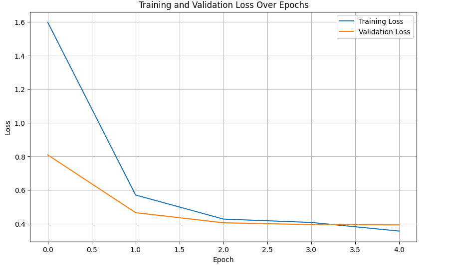

# IMPLEMENTATION OF TINY VGG

## Project Overview
This project implements a Convolutional Neural Network (CNN) for image classification on the Fashion MNIST dataset. The Fashion MNIST dataset consists of 60,000 training images and 10,000 test images, each a 28x28 grayscale image, associated with 10 classes of clothing items. The goal is to build and train a deep learning model capable of accurately classifying these fashion items.

## Dataset
-   **Name**: Fashion MNIST
-   **Description**: A dataset of Zalando's article images, dropping `pixel` from the original MNIST dataset for fashion product images. It consists of 10 categories.
-   **Shape**: Each image is 28x28 pixels.
-   **Classes**: 10 classes (T-shirt/top, Trouser, Pullover, Dress, Coat, Sandal, Shirt, Sneaker, Bag, Ankle boot).

## Model Architecture
The model is a deep Convolutional Neural Network (CNN) implemented using TensorFlow/Keras. It follows a VGG-like architecture with multiple convolutional blocks followed by max-pooling layers, and dense layers for classification.

### Layers Breakdown:
-   **Input Layer**: Accepts grayscale images of size (28, 28, 1).
-   **Convolutional Blocks (5 blocks)**:
    -   Each block consists of 2-3 `Conv2D` layers with 3x3 kernel size, `padding='same'`, and `relu` activation.
    -   Filters progressively increase (64, 128, 256, 512, 512).
    -   Each block is followed by a `MaxPool2D` layer with 2x2 pool size and 2x2 strides.
-   **Flatten Layer**: Converts the 2D feature maps into a 1D vector.
-   **Dense Layers (Fully Connected)**:
    -   Two `Dense` layers with 4096 units each and `relu` activation.
    -   **Output Layer**: A `Dense` layer with 10 units (corresponding to the 10 Fashion MNIST classes) and `softmax` activation for multi-class classification.

## Training

### Hyperparameters:
-   **Optimizer**: Adam
-   **Loss Function**: `sparse_categorical_crossentropy` (suitable for integer labels)
-   **Metrics**: Accuracy
-   **Epochs**: 5
-   **Callbacks**: Early Stopping with `monitor='val_loss'`, `patience=0`, and `restore_best_weights=True`.

### Training Progress:
The model was trained for 5 epochs. The training and validation loss were monitored to prevent overfitting. Early stopping was configured to halt training if validation loss did not improve.

## Results
The training process achieved the following performance metrics:
-   **Final Training Accuracy**: ~87.32%
-   **Final Validation Accuracy**: ~86.56%
-   **Final Training Loss**: ~0.3551
-   **Final Validation Loss**: ~0.3921

The plot below illustrates the training and validation loss over the epochs, showing the model's learning curve and convergence.

 <!-- Placeholder for a plot image -->

## How to Run
1.  **Dependencies**: Ensure you have TensorFlow and Keras installed.
    ```bash
    pip install tensorflow
    ```
2.  **Load Data**: The Fashion MNIST dataset is automatically loaded using `tensorflow.keras.datasets.fashion_mnist.load_data()`.
3.  **Model Definition**: The CNN model is defined programmatically in the notebook.
4.  **Training**: Execute the training cell to train the model.
5.  **Evaluation**: The model's performance on the test set is evaluated during training and can be further assessed post-training.

## Future Work
-   Experiment with different CNN architectures (e.g., ResNet, Inception).
-   Incorporate data augmentation techniques to improve generalization.
-   Perform hyperparameter tuning for optimization.
-   Visualize predictions and analyze misclassifications.
